# Guía de usuario: Asistencia remota

*Un recorrido por cada momento de una sesión de asistencia, mostrando a la
vez la pantalla del alumno y la del profesor. Las capturas están tomadas de
una sesión real y en vivo del plugin, con la interfaz de Moodle en español,
en un curso de demostración ("Digital Photography Basics").*

**Existe una versión interactiva de esta misma guía en
[jlsimon.github.io/moodle-local_remotesupport/user_guide.es.html](https://jlsimon.github.io/moodle-local_remotesupport/user_guide.es.html).**
También hay una [versión en inglés](https://jlsimon.github.io/moodle-local_remotesupport/user_guide.html)
([`user_guide.md`](user_guide.md)).

Asistencia remota permite que un profesor vea exactamente la página que un
alumno está mirando en Moodle y lo guíe a través de ella — señalar cosas,
chatear, seguir su navegación — sin tomar en ningún momento el control del
navegador del alumno. El alumno puede ver en todo momento quién está
conectado y puede finalizar la sesión de inmediato con un solo clic.

---

## 1. Antes de que empiece una sesión

Cualquier alumno que pueda solicitar asistencia en un curso ve un pequeño
botón flotante en cada página. Cualquier profesor que pueda prestar
asistencia tiene un panel que lista las solicitudes entrantes — vacío, hasta
que alguien pide ayuda.

| Alumno | Profesor |
|---|---|
| 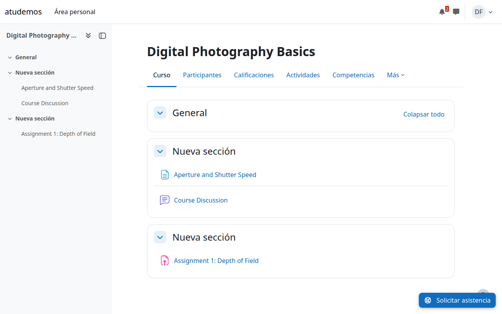 | 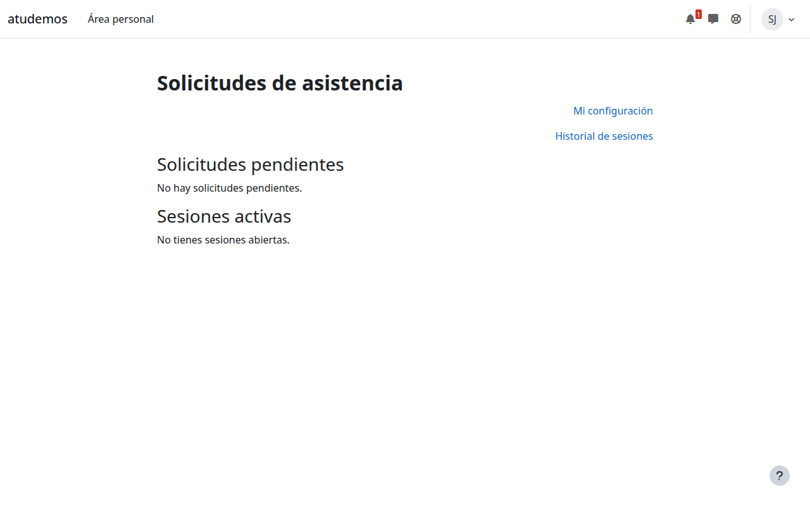 |

## 2. El alumno solicita ayuda

Al pulsar el botón se abre un formulario breve. El alumno puede explicar,
de forma opcional, qué necesita — texto plano, visible solo para el
profesor que acepte la solicitud.

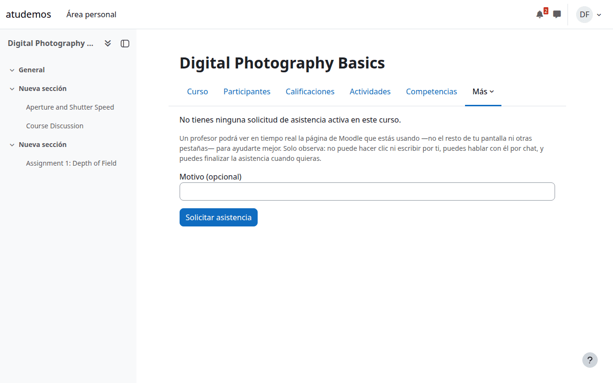

Al enviarlo, el alumno ve que su solicitud está esperando a un profesor.

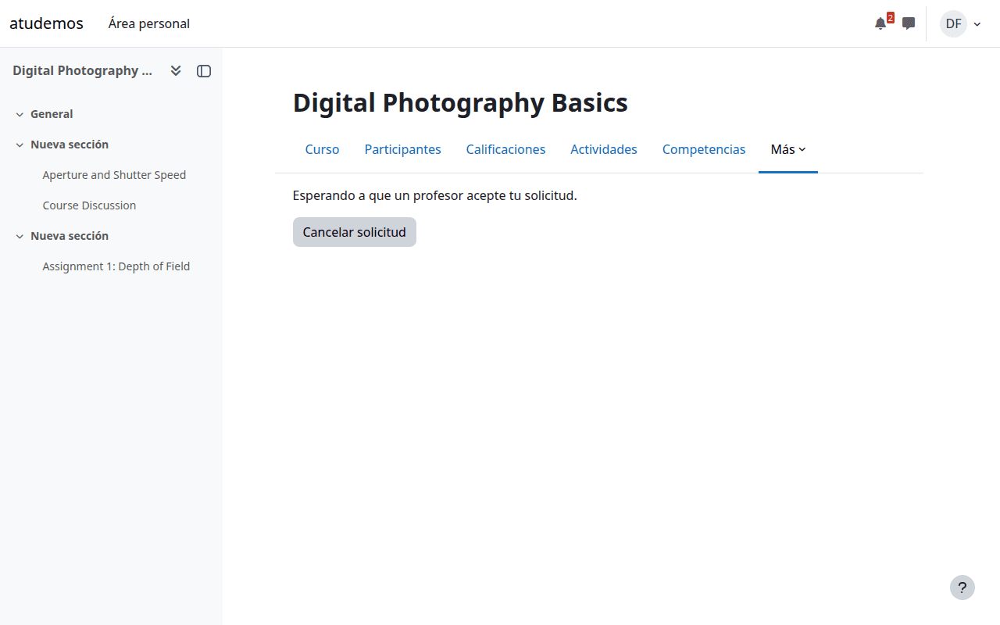

## 3. El profesor ve la solicitud

La solicitud aparece en el panel del profesor con el nombre del alumno, el
curso y cuánto tiempo lleva esperando. Un clic la acepta.

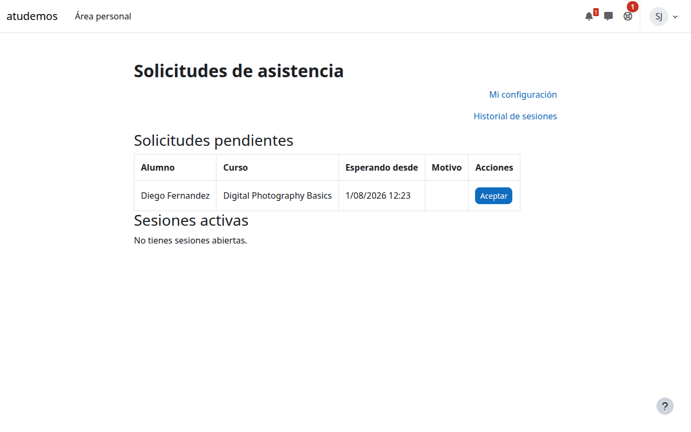

## 4. Empieza la sesión — pantalla compartida

Al aceptar, el profesor entra directamente en una vista en vivo de la
pantalla del alumno. Se actualiza automáticamente a medida que el alumno
navega — el profesor ve la misma página, el mismo contenido, casi en
tiempo real. El alumno, por su parte, sigue navegando con normalidad, con
una pequeña barra de estado que le recuerda que hay un profesor conectado y
una forma de finalizar la sesión con un solo clic en cualquier momento.

| Alumno | Reconstrucción de la pantalla del alumno en el profesor |
|---|---|
| 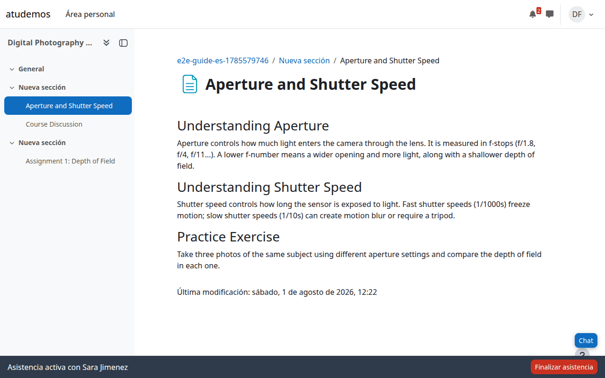 | 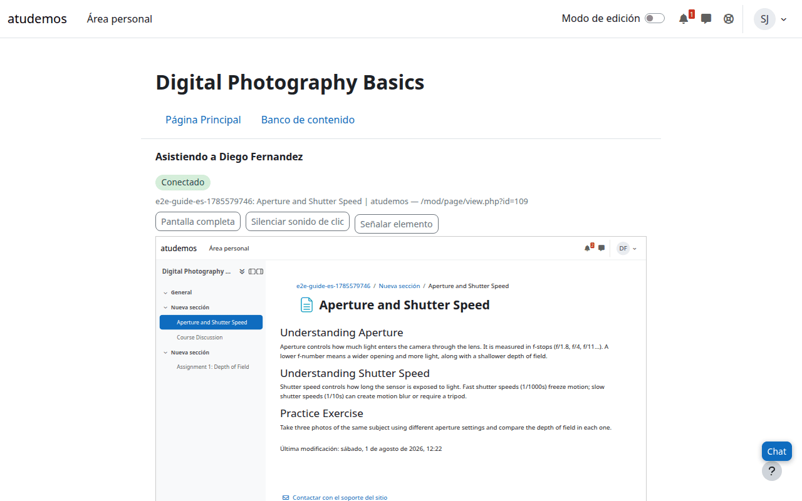 |

Esto es una **reconstrucción de solo lectura**, no una herramienta de
control remoto: el profesor no puede hacer clic, escribir ni navegar en
nombre del alumno.

## 5. Chat

Ambas partes pueden abrir un pequeño panel de chat sin salir de la página
en la que están.

| Alumno | Profesor |
|---|---|
| 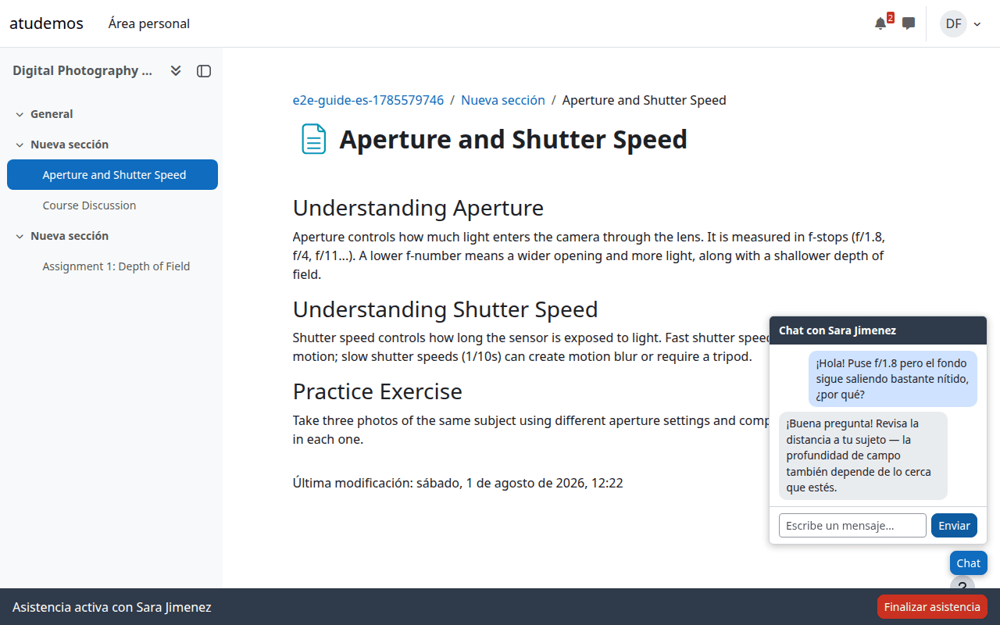 | 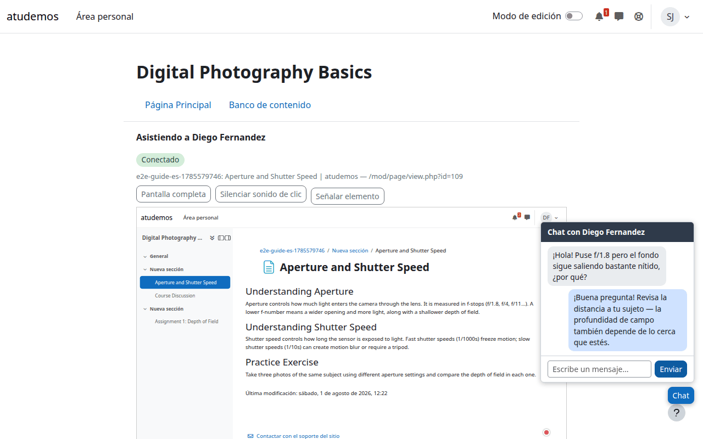 |

## 6. El profesor señala algo

Si el sitio lo permite, el profesor puede elegir un elemento dentro de su
reconstrucción de la página — un enlace, un botón, un encabezado — y
aparece un recuadro resaltado alrededor de ese mismo elemento en la
pantalla *real* del alumno, con una etiqueta que deja claro que viene del
profesor. Es un puntero, no un clic: no se pulsa nada en nombre del
alumno.

| Alumno viendo el resaltado | Profesor eligiendo un elemento |
|---|---|
| 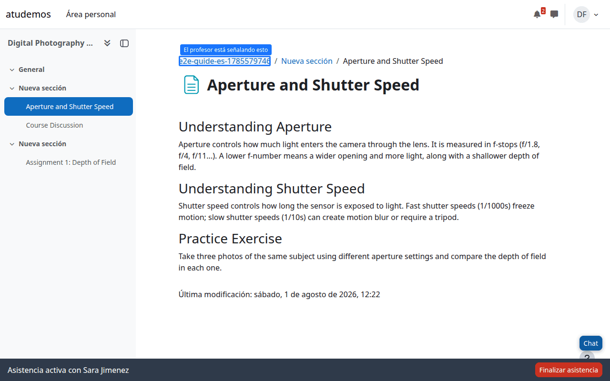 | 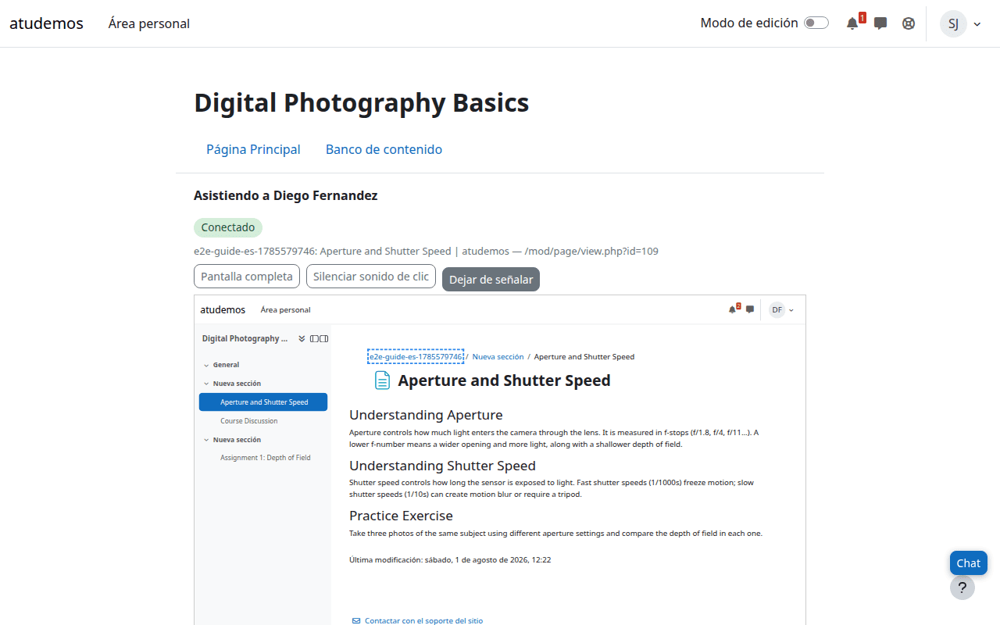 |

## 7. Finalizar la sesión

Cualquiera de las dos partes puede finalizar la sesión en cualquier
momento. Aquí la finaliza el alumno — el botón de su barra de estado lo
devuelve directamente a la navegación normal.

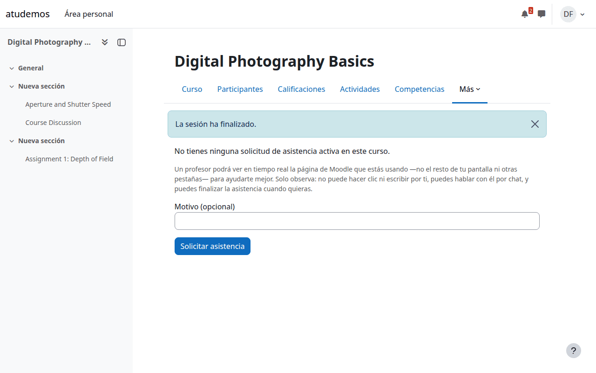

El profesor ve un aviso claro de que el alumno se ha marchado, con un
enlace para volver a su lista de solicitudes.

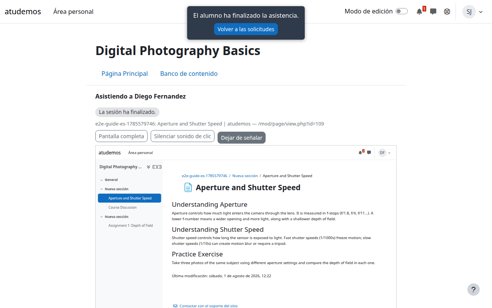

## 8. Después — historial y reproducción

Los profesores pueden ver sus propias sesiones pasadas: a quién ayudaron,
en qué curso y durante cuánto tiempo.

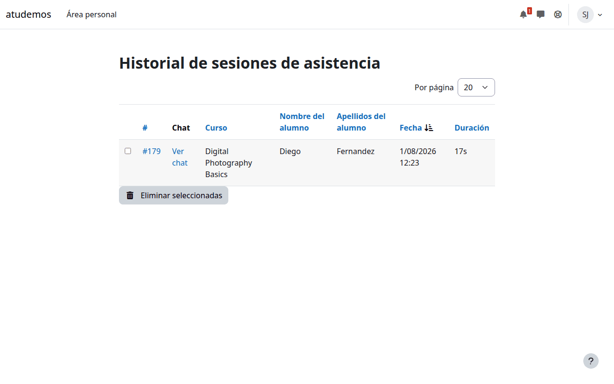

Si el sitio lo permite, toda la actividad de pantalla y el chat de una
sesión finalizada pueden reproducirse más tarde — la misma reconstrucción
exacta que vio el profesor en directo, reproducida de nuevo.

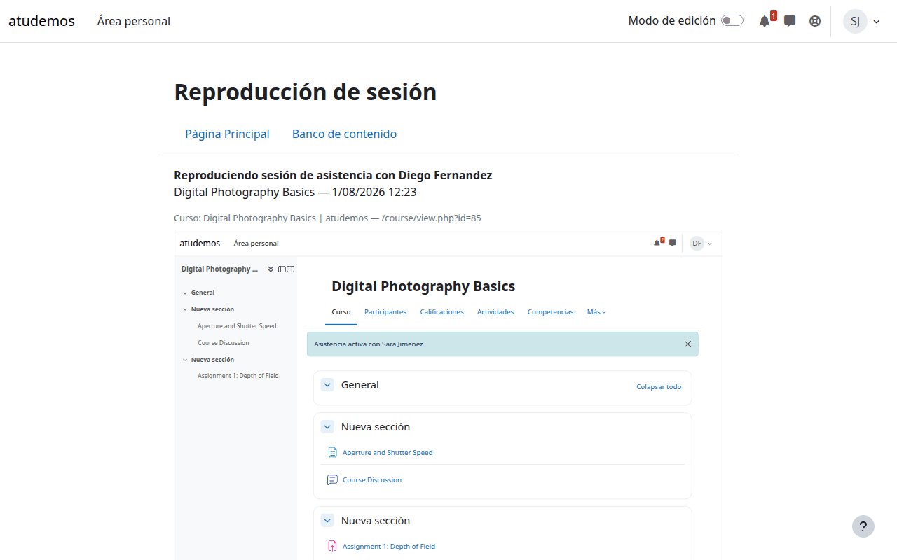

---

## Una nota sobre privacidad y consentimiento

Cada captura de esta guía refleja el comportamiento real y actual del
plugin, no una simulación idealizada:

- El alumno siempre ve, en una barra de estado persistente, que hay una
  sesión activa y **quién** es el profesor.
- La vista del profesor es una reconstrucción hecha a partir del propio
  contenido de la página — nunca un vídeo ni una captura de pantalla, y
  nunca nada de otra pestaña, otra aplicación o un sitio web externo.
- Los campos sensibles (contraseñas, campos ocultos) nunca se capturan, en
  ninguna capa.
- El alumno puede finalizar la sesión de inmediato, desde cualquier
  página, con un solo clic — el profesor no puede impedirlo ni retrasarlo.

Consulta `docs/security.md` y `docs/limitations.md` para el detalle
técnico completo detrás de estas garantías.
