# User Guide: Remote Assistance

*A walkthrough of every stage of a support session, shown from both the
student's and the teacher's screen at the same time. Screenshots are taken
from a real, live session of the plugin, in a demo course ("Digital
Photography Basics").*

**A richer, interactive version of this same guide is available at
[jlsimon.github.io/moodle-local_remotesupport/user_guide.html](https://jlsimon.github.io/moodle-local_remotesupport/user_guide.html).**

Remote Assistance lets a teacher see the exact page a student is looking at
in Moodle and guide them through it — point at things, chat, and follow
along — without ever taking control of the student's browser. The student
can see who is connected at all times and can end the session immediately
with one click.

---

## 1. Before a session begins

Any student who can request assistance in a course sees a small floating
button on every page. Any teacher who can provide assistance has a
dashboard that lists incoming requests — empty, until someone asks for help.

| Student | Teacher |
|---|---|
| 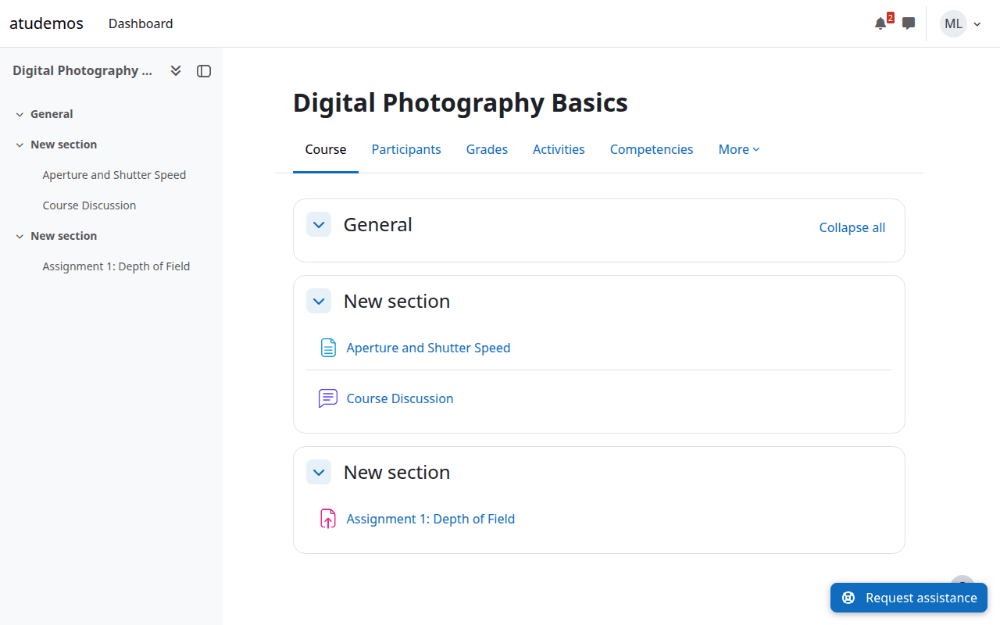 | 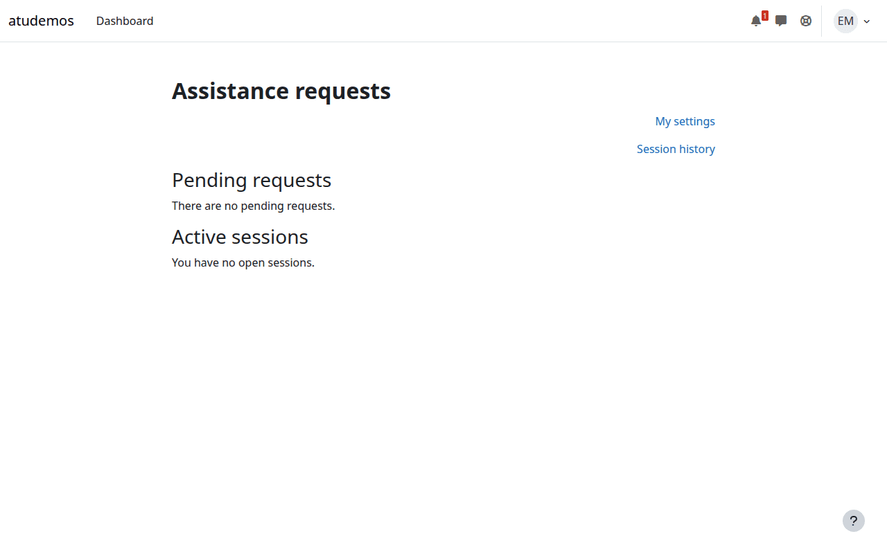 |

## 2. The student requests help

Clicking the button opens a short form. The student can optionally explain
what they need help with — this is plain text, shown only to the teacher who
accepts the request.

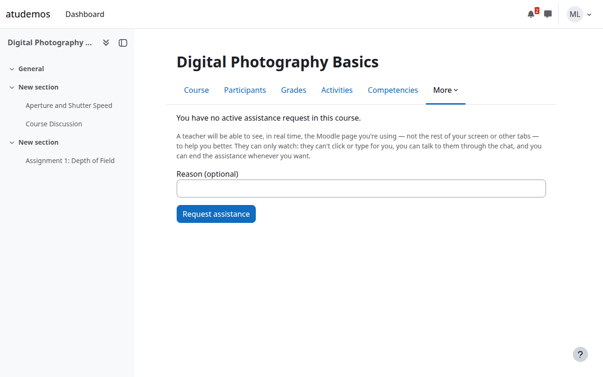

Once submitted, the student sees their request is waiting for a teacher.

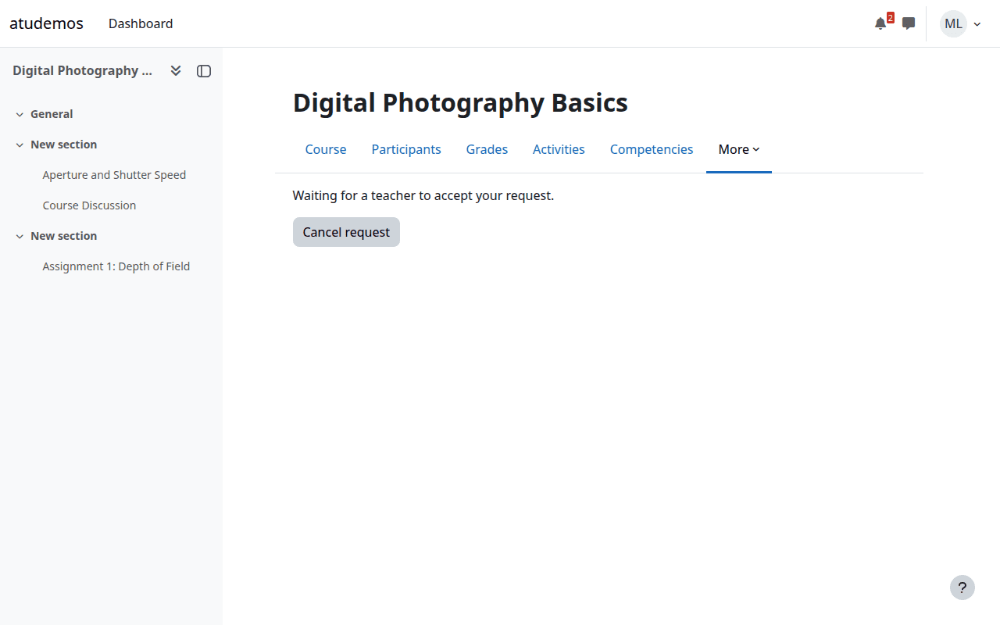

## 3. The teacher sees the request

The request appears on the teacher's dashboard with the student's name, the
course, and how long they've been waiting. One click accepts it.

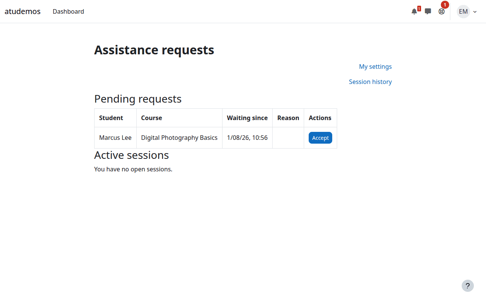

## 4. The session begins — screen sharing

Accepting takes the teacher straight into a live view of the student's
screen. It updates automatically as the student navigates — the teacher
sees the same page, the same content, in near real time. The student, on
their side, keeps browsing normally with a small status bar reminding them
a teacher is connected, plus a one-click way to end the session at any time.

| Student's own screen | Teacher's reconstruction of the student's screen |
|---|---|
| 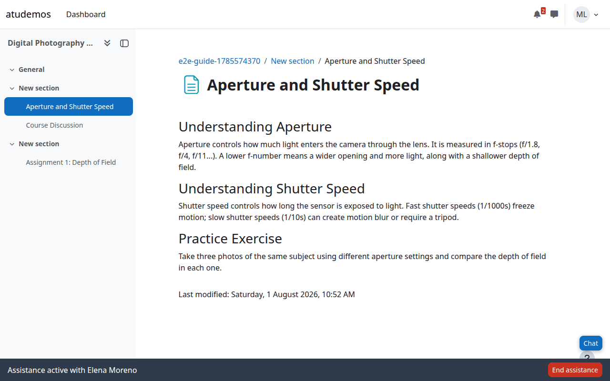 | 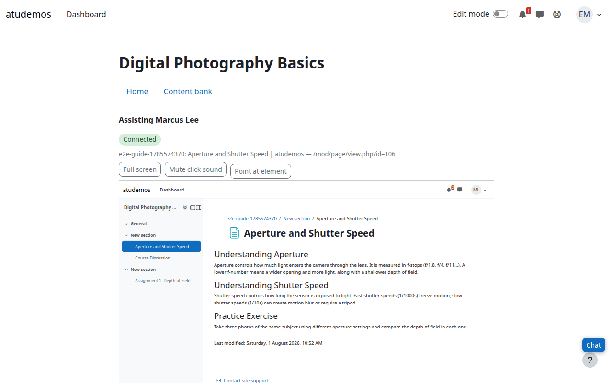 |

This is a **read-only reconstruction**, not a screen-control tool: the
teacher cannot click, type, or navigate on the student's behalf. What they
*can* do is talk to the student (see below) and point at things.

## 5. Chat

Both sides can open a small chat panel without leaving the page they're on.

| Student | Teacher |
|---|---|
| 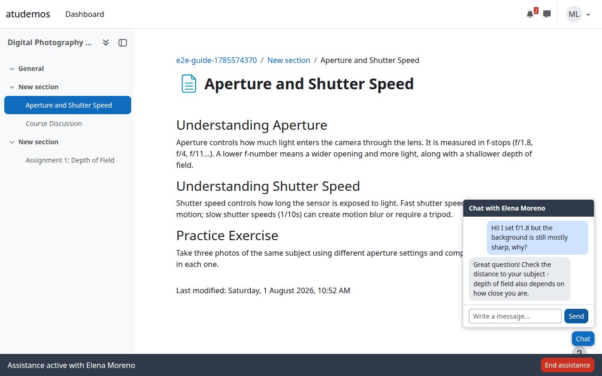 | 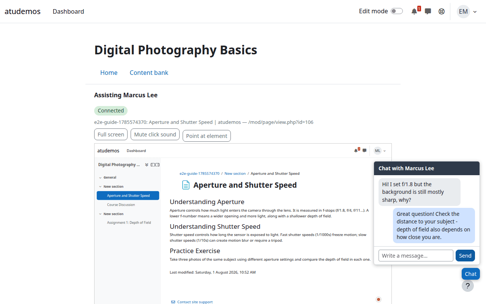 |

## 6. The teacher points at something

If a site enables it, the teacher can pick an element inside their
reconstruction of the page — a link, a button, a heading — and a highlight
box appears around that same element on the student's *real* screen, with a
label so it's clearly marked as coming from the teacher. It's a pointer, not
a click: nothing gets pressed on the student's behalf.

| Student seeing the highlight | Teacher picking an element |
|---|---|
| 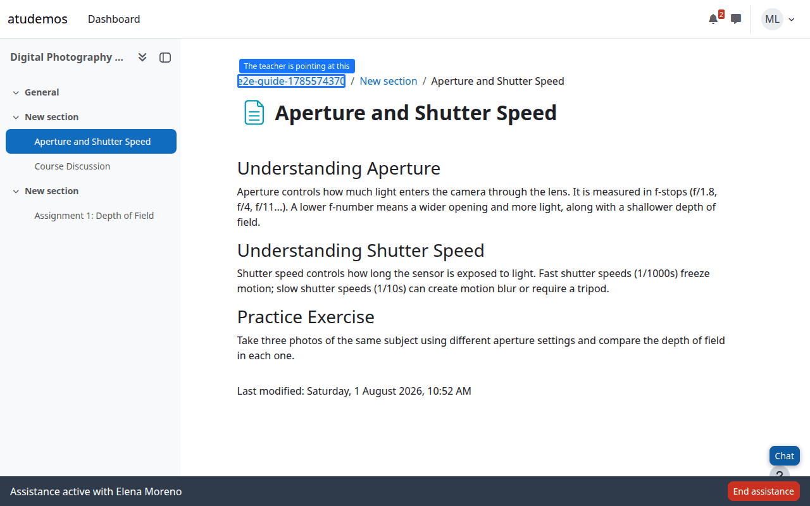 | 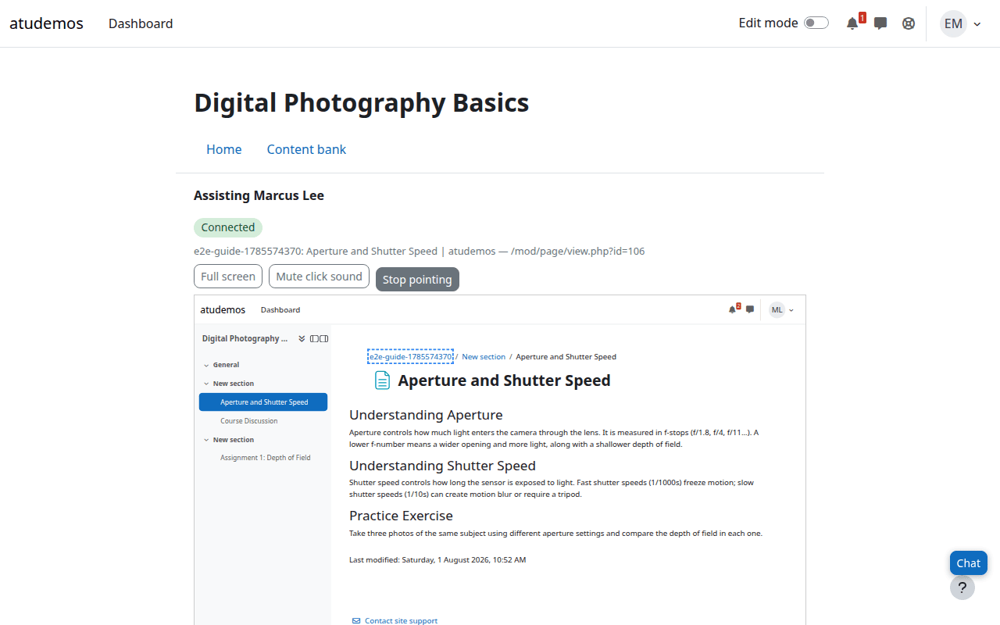 |

## 7. Ending the session

Either side can end the session at any moment. Here the student ends it —
their status bar's button takes them right back to normal browsing.

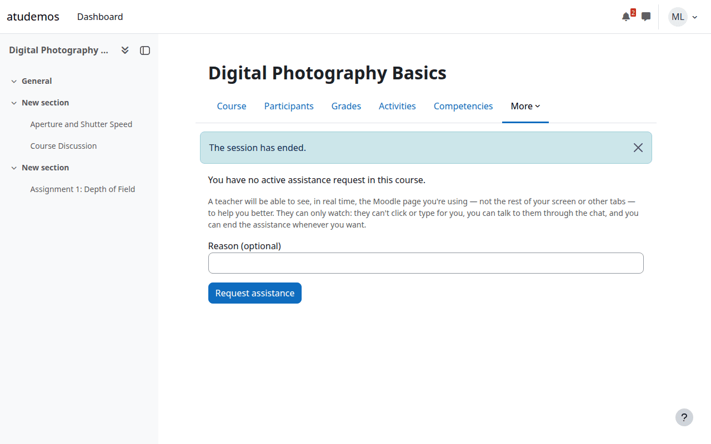

The teacher sees a clear notice that the student has left, with a way back
to their list of requests.

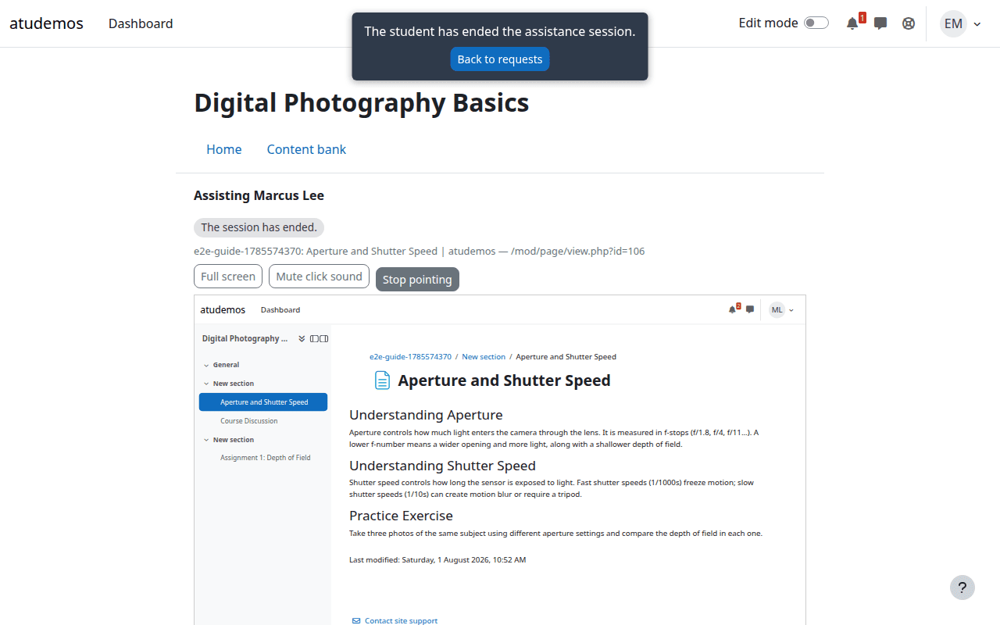

## 8. Afterward — session history and replay

Teachers can see their own past sessions: who they helped, in what course,
and for how long.

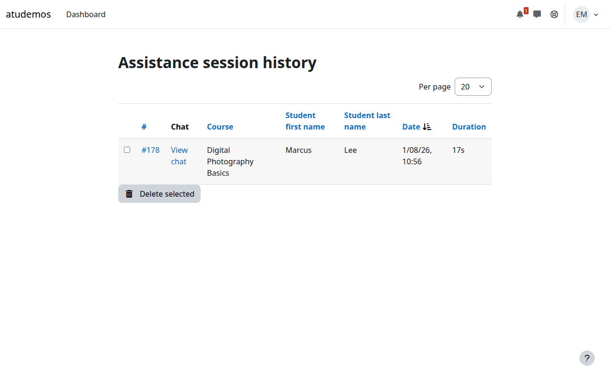

If the site allows it, a closed session's full screen activity and chat can
be replayed later — the exact same reconstruction the teacher saw live,
played back.

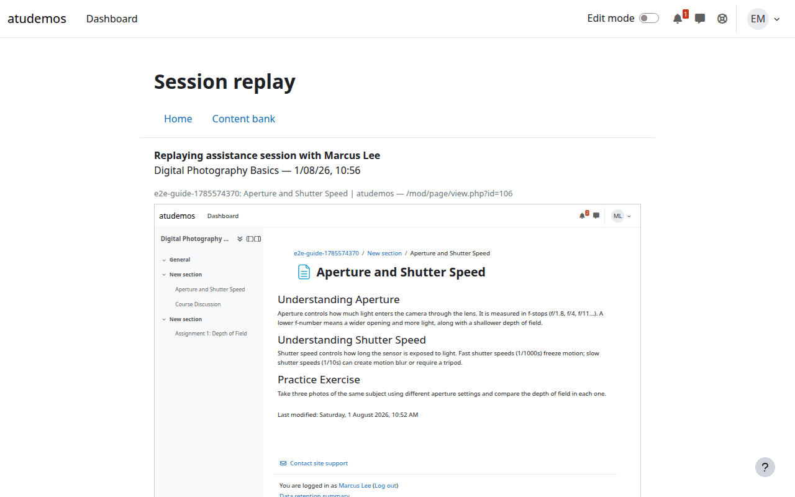

---

## A note on privacy and consent

Every screenshot above reflects the actual, current behavior of the plugin,
not an idealized mockup:

- The student always sees, in a persistent status bar, that a session is
  active and **who** the teacher is.
- The teacher's view is a reconstruction built from the page's own content —
  never a video or screen capture, and never anything from another browser
  tab, another application, or an external website.
- Sensitive fields (passwords, hidden inputs) are never captured, at any
  layer.
- The student can end the session immediately, from any page, with one
  click — the teacher cannot prevent or delay this.

See `docs/security.md` and `docs/limitations.md` for the full technical
detail behind these guarantees.
